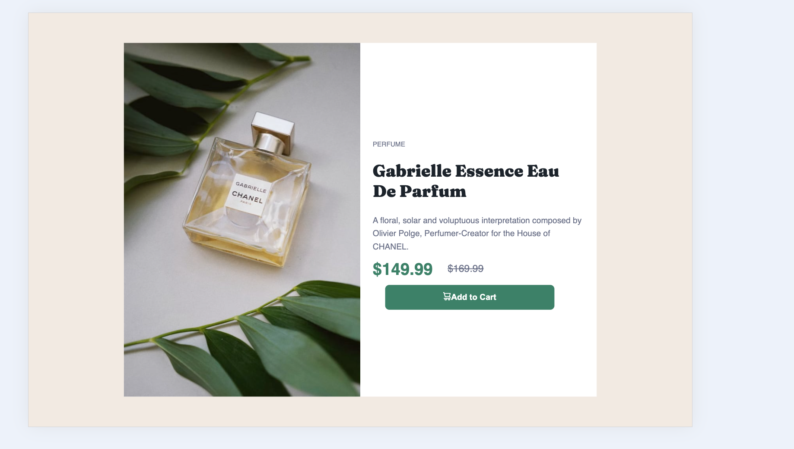

# product-preview-card-component
# Product Preview Card Component

This is my solution to the [Product preview card component challenge on Frontend Mentor](https://www.frontendmentor.io/challenges/product-preview-card-component-GO7UmttRfa).

🔗 [Live site](https://bruchno.github.io/product-preview-card-component/)  
📦 [Repository](https://github.com/Bruchno/product-preview-card-component)

---

## 📸 Screenshot

---

## 🧩 Built with

- Semantic HTML
- Custom CSS variables
- Flexbox
- Responsive design with media queries
- Mobile-first approach

---

## 🚀 What I learned

While building this component, I practiced:

- Structuring semantic HTML for a compact layout
- Styling elements with consistent spacing and color variables
- Adapting the layout for different screen sizes using media queries
- Refining visual details like typography and hover states

This challenge helped me improve the balance between flexibility and design fidelity — especially when switching between desktop and mobile views.

---

## 🔧 Areas for future development

I'd like to:

- Explore how to modularize the component for reuse
- Integrate this style into larger product layout templates
- Experiment with animation for hover states or transitions

---

## 📚 Useful resources

- [Frontend Mentor](https://www.frontendmentor.io/) — Challenges and feedback
- [MDN Web Docs](https://developer.mozilla.org/) — CSS and HTML references
- [CSS Tricks](https://css-tricks.com/) — Layout tips and best practices

---

## 👩‍💻 Author

- GitHub: [Bruchno](https://github.com/Bruchno)
- Frontend Mentor: [@Bruchno](https://www.frontendmentor.io/profile/Bruchno)

---

## 🙌 Acknowledgments

Thank you to the Frontend Mentor community for feedback, and my mentor for thoughtful insights. This challenge helped me strengthen my layout skills and attention to design detail.

